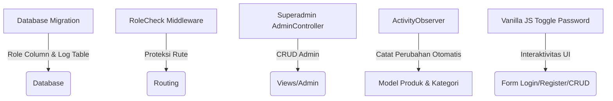

# 🚀 Panduan Penggabungan Fitur Super Admin & Log Aktivitas

Panduan ini disusun sebagai peta jalan (*blueprint*) dan pengingat teknis saat Anda melakukan **merge** atau penggabungan proyek DefaCraftStore dengan repositori yang memiliki fitur **Super Admin**, **CRUD Akun Admin**, **Sistem Log Ringkas**, dan **Interaktivitas Toggle Password**.

---

## 📌 Area Kerja Utama & Struktur Berkas
Berikut adalah komponen berkas utama yang akan dibuat/dimodifikasi saat penggabungan fitur:



---

## 🛠️ 1. Penambahan Super Admin & Role Protection

### A. Migrasi Kolom Role (`users` table)
Tambahkan kolom `role` pada tabel `users` untuk membedakan antara `superadmin`, `admin`, dan `pembeli`.

```php
// database/migrations/xxxx_xx_xx_xxxxxx_add_role_to_users_table.php
public function up(): void
{
    Schema::table('users', function (Blueprint $table) {
        if (!Schema::hasColumn('users', 'role')) {
            $table->enum('role', ['superadmin', 'admin', 'pembeli'])->default('pembeli')->after('email');
        }
    });
}
```

> [!TIP]
> Di dalam `DatabaseSeeder.php` atau `AdminSeeder.php`, pastikan untuk menambahkan setidaknya satu akun `superadmin` default agar sistem bisa diakses pertama kali setelah migrasi ulang.

### B. Middleware Proteksi `RoleCheck`
Buat middleware baru untuk memeriksa hak akses berdasarkan satu atau beberapa role sekaligus.

```bash
php artisan make:middleware RoleCheck
```

```php
// app/Http/Middleware/RoleCheck.php
namespace App\Http\Middleware;

use Closure;
use Illuminate\Http\Request;
use Illuminate\Support\Facades\Auth;

class RoleCheck
{
    public function handle(Request $request, Closure $next, ...$roles)
    {
        if (!Auth::check()) {
            return redirect()->route('login')->with('error', 'Silakan login terlebih dahulu.');
        }

        $user = Auth::user();
        if (in_array($user->role, $roles)) {
            return $next($request);
        }

        abort(403, 'Anda tidak memiliki hak akses untuk halaman ini.');
    }
}
```

### C. Registrasi Middleware
Tergantung pada versi Laravel proyek tujuan merge Anda:

#### Pilihan 1: Laravel 11 (Standard Terbaru)
Daftarkan alias di dalam file `bootstrap/app.php`:
```php
->withMiddleware(function (Middleware $middleware) {
    $middleware->alias([
        'role' => \App\Http\Middleware\RoleCheck::class,
    ]);
})
```

#### Pilihan 2: Laravel 10 / Sebelumnya
Daftarkan di `$routeMiddleware` di dalam `app/Http/Kernel.php`:
```php
protected $routeMiddleware = [
    // ...
    'role' => \App\Http\Middleware\RoleCheck::class,
];
```

---

## 👥 2. CRUD Admin (Oleh Superadmin)

Hanya `superadmin` yang diperbolehkan mengelola akun `admin` biasa.

### A. Routing Terproteksi
Gunakan middleware `'role:superadmin'` untuk mengamankan grup rute ini.

```php
// routes/web.php
use App\Http\Controllers\Superadmin\AdminController;

Route::middleware(['auth', 'role:superadmin'])->prefix('superadmin')->name('superadmin.')->group(function () {
    Route::resource('admin', AdminController::class);
});
```

### B. Controller `AdminController`
Buat controller khusus di folder `app/Http/Controllers/Superadmin/`:

```php
// app/Http/Controllers/Superadmin/AdminController.php
namespace App\Http\Controllers\Superadmin;

use App\Http\Controllers\Controller;
use App\Models\User;
use Illuminate\Http\Request;
use Illuminate\Support\Facades\Hash;
use Illuminate\Validation\Rules;

class AdminController extends Controller
{
    public function index()
    {
        $admins = User::where('role', 'admin')->latest()->paginate(10);
        return view('superadmin.admin.index', compact('admins'));
    }

    public function store(Request $request)
    {
        $request->validate([
            'name' => ['required', 'string', 'max:255'],
            'email' => ['required', 'string', 'email', 'max:255', 'unique:users'],
            'password' => ['required', Rules\Password::defaults()],
        ]);

        User::create([
            'name' => $request->name,
            'email' => $request->email,
            'role' => 'admin',
            'password' => Hash::make($request->password),
        ]);

        return redirect()->route('superadmin.admin.index')->with('success', 'Admin baru berhasil ditambahkan.');
    }
    
    // Lengkapi dengan method edit(), update(), dan destroy() untuk CRUD sempurna
}
```

---

## 📝 3. Log Ringkas (Log Aktivitas Otomatis)

Sistem pencatatan ringan untuk memonitor perubahan data (tambah, edit, hapus) di dalam aplikasi.

### A. Migrasi Tabel `activity_logs`
```php
// database/migrations/xxxx_xx_xx_xxxxxx_create_activity_logs_table.php
public function up(): void
{
    Schema::create('activity_logs', function (Blueprint $table) {
        $table->id();
        $table->unsignedBigInteger('user_id')->nullable(); // Siapa pelakunya
        $table->string('model'); // Nama model (e.g. Produk, Kategori)
        $table->unsignedBigInteger('model_id')->nullable(); // ID data yang diubah
        $table->string('aksi'); // 'tambah', 'ubah', 'hapus'
        $table->text('deskripsi'); // Detail informasi log
        $table->timestamps();

        $table->foreign('user_id')->references('id')->on('users')->onDelete('set null');
    });
}
```

### B. Aktivitas Model Observer
Cara paling elegan untuk mencatat log perubahan tanpa mengotori kode Controller adalah dengan menggunakan **Laravel Observers**.

1. Buat Model `ActivityLog`:
   ```bash
   php artisan make:model ActivityLog
   ```
2. Buat Observer baru:
   ```bash
   php artisan make:observer ActivityObserver
   ```

```php
// app/Observers/ActivityObserver.php
namespace App\Observers;

use App\Models\ActivityLog;
use Illuminate\Database\Eloquent\Model;
use Illuminate\Support\Facades\Auth;

class ActivityObserver
{
    protected function log(Model $model, string $aksi, string $deskripsi)
    {
        ActivityLog::create([
            'user_id'  => Auth::id(),
            'model'    => get_class($model),
            'model_id' => $model->getKey(),
            'aksi'     => $aksi,
            'deskripsi'=> $deskripsi,
        ]);
    }

    public function created(Model $model)
    {
        $this->log($model, 'tambah', "Menambahkan data baru pada " . class_basename($model) . " dengan nama: " . ($model->nama ?? $model->name ?? $model->id));
    }

    public function updated(Model $model)
    {
        $this->log($model, 'ubah', "Mengubah data pada " . class_basename($model) . " (ID: " . $model->getKey() . ")");
    }

    public function deleted(Model $model)
    {
        $this->log($model, 'hapus', "Menghapus data pada " . class_basename($model) . " (ID: " . $model->getKey() . ")");
    }
}
```

### C. Daftarkan Observer di `AppServiceProvider`
Buka `app/Providers/AppServiceProvider.php` dan daftarkan model yang ingin dipantau log perubahannya:

```php
use App\Models\Produk;
use App\Models\Kategori;
use App\Models\User;
use App\Observers\ActivityObserver;

public function boot(): void
{
    // Daftarkan model ke Observer secara dinamis
    Produk::observe(ActivityObserver::class);
    Kategori::observe(ActivityObserver::class);
    User::observe(ActivityObserver::class);
}
```

---

## 👁️ 4. Toggle Mata untuk Password

Fitur interaktif sederhana untuk menampilkan/menyembunyikan password di form login, register, dan CRUD Admin.

### A. Markup HTML (Menggunakan Bootstrap + FontAwesome / Emojis)
```html
<div class="mb-3">
    <label for="password" class="form-label">Password</label>
    <div class="input-group">
        <input type="password" class="form-control" id="password" name="password" required>
        <button class="btn btn-outline-secondary toggle-password" type="button" data-target="password">
            👁️
        </button>
    </div>
</div>
```

### B. JavaScript Interaktif (Vanilla JS)
Letakkan script ini secara global atau panggil di layout utama agar berfungsi di seluruh form password.

```javascript
document.addEventListener('DOMContentLoaded', function () {
    document.querySelectorAll('.toggle-password').forEach(button => {
        button.addEventListener('click', function () {
            const targetId = this.getAttribute('data-target');
            const passwordInput = document.getElementById(targetId);
            
            if (passwordInput) {
                if (passwordInput.type === 'password') {
                    passwordInput.type = 'text';
                    this.textContent = '🙈'; // Ganti ikon/emoji saat terlihat
                } else {
                    passwordInput.type = 'password';
                    this.textContent = '👁️'; // Ganti ikon/emoji saat tersembunyi
                }
            }
        });
    });
});
```

---

## 📋 Checklist Integrasi Merge

| Fitur | Status | Catatan Teknis |
| :--- | :---: | :--- |
| **Migrasi `users` (Role)** | ⬜ *Belum* | Daftarkan tipe enum `superadmin`, `admin`, `pembeli`. |
| **Seeder Akun Superadmin** | ⬜ *Belum* | Tambahkan 1 akun superadmin di database seeder. |
| **Middleware `RoleCheck`** | ⬜ *Belum* | Batasi akses URL `/superadmin` & `/admin`. |
| **CRUD Admin Controllers** | ⬜ *Belum* | Superadmin bisa create, read, update, delete role `admin`. |
| **Tabel `activity_logs`** | ⬜ *Belum* | Skema log dengan `user_id` relasi ke tabel `users`. |
| **Model Observer Register** | ⬜ *Belum* | Registrasi Model Produk, Kategori, User di `AppServiceProvider`. |
| **Toggle Password JS** | ⬜ *Belum* | Integrasikan ke file `login.blade.php`, `register.blade.php`. |

> [!NOTE]
> Seluruh panduan ini dirancang agar portabel dan kompatibel dengan Laravel 10 maupun Laravel 11. Saat melakukan merge, pastikan untuk mendahulukan migrasi database sebelum menjalankan seeder.
